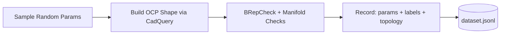

# Failure-Aware CAD Validity Predictor — Technical Report

**Project:** Pre-Execution Validity Prediction for Parametric CAD Constructions  
**Domain:** CAD / Computational Geometry / Machine Learning  
**Language:** Python 3.11 &emsp; | &emsp; **ML Framework:** scikit-learn &emsp; | &emsp; **CAD Kernel:** OpenCascade (via CadQuery)

---

## Table of Contents

1. [Deliverable 1 — Source Code](#1-deliverable-1--source-code)
2. [Deliverable 2 — Dataset Generation Procedure](#2-deliverable-2--dataset-generation-procedure)
3. [Deliverable 3 — Trained Model & Training Pipeline](#3-deliverable-3--trained-model--training-pipeline)
4. [Deliverable 4 — Technical Report](#4-deliverable-4--technical-report)
   - [4.1 Feature Design](#41-feature-design)
   - [4.2 Model Architecture](#42-model-architecture)
   - [4.3 Evaluation Metrics](#43-evaluation-metrics)
   - [4.4 Failure Analysis](#44-failure-analysis)
   - [4.5 Limitations & Ambiguity Discussion](#45-limitations--ambiguity-discussion)

---

## 1. Deliverable 1 — Source Code

### Repository Structure

```
cad/
├── src/                          # Core library
│   ├── generators/               # Parametric CAD shape generators
│   │   ├── base.py               # BaseGenerator ABC, Sample dataclass, label constants
│   │   ├── valid.py              # 5 valid-shape sub-families
│   │   ├── self_intersection.py  # 3 self-intersecting patterns
│   │   ├── non_manifold.py       # 5 non-manifold patterns
│   │   ├── degenerate.py         # 4 degenerate-geometry patterns
│   │   └── tolerance.py          # 4 tolerance-error patterns
│   ├── features/                 # Feature extraction modules
│   │   ├── __init__.py           # Unified API, FEATURE_NAMES (60 cols), build_pipeline()
│   │   ├── base_features.py      # 36 geometric features (bbox, topo, ratios, interactions)
│   │   └── graph_features.py     # 24 Face Adjacency Graph features
│   └── kernel_check.py           # BRepCheck_Analyzer + manifold validation
├── scripts/                      # Pipeline scripts
│   ├── generate_dataset.py       # Data generation
│   ├── extract_features.py       # Feature matrix construction
│   ├── analyze_features.py       # Feature importance & correlation
│   ├── train_models.py           # RF + calibration + ensemble
│   ├── phase3_audit.py           # Comprehensive model audit
│   ├── phase4_evaluation.py      # Evaluation & failure analysis
│   ├── predict.py                # CLI prediction tool
│   └── diagnose_predictions.py   # Diagnostic utilities
├── data/                         # Generated datasets (gitignored)
├── models/                       # Trained model artifacts (gitignored)
├── examples/                     # Example prediction I/O files
├── docs/                         # Project documentation
├── requirements.txt              # pip dependencies
├── test_cad_setup.py             # Environment verification script
└── GEMINI.md                     # Project context file
```

### Key Design Decisions

- **Modular generators:** Each failure class is implemented as a standalone Python class inheriting from `BaseGenerator`, enabling easy extension with new failure patterns.
- **Dual labeling:** Every sample carries both a kernel-derived label (actual OCC result) and an intended label (what the generator was designed to produce), solving the problem where degenerate/tolerance shapes pass kernel checks despite being problematic.
- **Canonical feature order:** The `FEATURE_NAMES` list in `src/features/__init__.py` defines the exact column order for all models, ensuring train-time and inference-time vectors are always aligned.

---

## 2. Deliverable 2 — Dataset Generation Procedure

### Overview

The dataset is generated synthetically using parametric CAD generators that produce shapes across **5 failure classes** and **21 sub-families**, then validated by the OpenCascade kernel.

### Procedure



**Step 1 — Parameter Sampling:** Each generator's `sample_params(rng)` draws randomized construction parameters (dimensions, radii, offsets, etc.) using a seeded NumPy RNG for full reproducibility.

**Step 2 — Shape Construction:** `build(params)` constructs the 3D B-Rep shape via CadQuery/OCP. Construction exceptions are caught and recorded rather than halting the pipeline.

**Step 3 — Kernel Validation:** `check_shape()` runs:
- `BRepCheck_Analyzer` — standard OCC validity check
- Custom manifold checks — multi-solid compounds, open shells, shell-solid imbalance

**Step 4 — Serialization:** Each sample is flattened to a JSON record with `param_*` fields, topology counts (`topo_*`), kernel result, and dual labels.

### Dataset Summary

| Class | Sub-Families | Samples | Kernel Valid | Kernel Invalid |
|-------|-------------|---------|------------|---------------|
| Valid | box, cylinder, sphere, boolean_union, filleted_box | 500 | 495 | 5 |
| Self-Intersection | bowtie_extrude, twisted_polygon, multi_cross | 500 | 0 | 500 |
| Non-Manifold | face/edge/vertex sharing, open_shell, t_junction | 500 | 0 | 500 |
| Degenerate | zero_dim_box, near_zero_extrude, extreme_aspect, collinear | 500 | 500 | 0 |
| Tolerance Error | sub_tolerance, scale_mismatch, micro_fillet, near_coincident | 500 | 500 | 0 |
| **Total** | **21** | **2,500** | **1,495** | **1,005** |

### Reproducibility

```bash
python scripts/generate_dataset.py --samples-per-class 500 --seed 42
```

The seed controls all random parameter generation. The same seed produces identical datasets across runs.

---

## 3. Deliverable 3 — Trained Model & Training Pipeline

### Pipeline Summary

```mermaid
flowchart TD
    X[X.npy, y.npy] --> Split[Stratified Split: 70/15/15]
    Split --> Train[Train Set: 1,750]
    Split --> Val[Val Set: 375]
    Split --> Test[Test Set: 375]
    
    Train --> RF[Random Forest (200 trees)]
    Train & Val --> CAL[Calibrated RF (Platt, 5-fold)]
    Train --> ENS[Ensemble: 5 × RF]
    Val --> Tune[Tune Uncertainty Thresholds]
    
    RF --> Save1[(rf_model.joblib)]
    CAL --> Save2[(model.pkl)]
    ENS --> Save3[(uncertainty_ensemble.joblib)]
```

### Saved Model Artifacts

| File | Format | Description |
|------|--------|-------------|
| `models/rf_model.joblib` | joblib | Primary Random Forest (200 trees, balanced weights) |
| `models/model.pkl` | pickle | Calibrated RF via CalibratedClassifierCV (sigmoid, 5-fold) |
| `models/uncertainty_ensemble.joblib` | joblib | 5-model ensemble (seeds: 42, 153, 264, 375, 486) |
| `models/training_config.json` | JSON | Full hyperparameters, split ratios, thresholds |
| `models/training_results.json` | JSON | Per-stage metrics for all models |
| `models/label_encoder.json` | JSON | Label ↔ class name mapping |

### Reproduction Commands

```bash
# Feature extraction
python scripts/extract_features.py

# Model training
python scripts/train_models.py

# Evaluation
python scripts/phase4_evaluation.py

# Prediction
python scripts/predict.py test_input.json --pretty --explain
```

---

## 4. Deliverable 4 — Technical Report

### 4.1 Feature Design

Each CAD shape is encoded as a **60-dimensional feature vector** drawn from two complementary sources:

**Base Geometric Features (36 dimensions):**

| Group | Count | Key Features |
|-------|-------|-------------|
| Bounding box | 5 | `bbox_lx`, `bbox_ly`, `bbox_lz`, `bbox_vol`, `bbox_diag` |
| Sorted dimensions | 3 | `dim_min`, `dim_mid`, `dim_max` |
| Ratios | 3 | `aspect_ratio`, `mid_ratio`, `compactness` |
| Volume/Area | 2 | `volume`, `surface_area` |
| Topology counts | 9 | `n_vertices`, `n_edges`, `n_faces`, `n_shells`, `n_solids`, `euler_char`, etc. |
| Flags | 3 | `has_boolean_op`, `has_compound`, `is_multi_solid` |
| Tolerance metrics | 3 | `min_dim_over_tol`, `log_min_dim`, `log_volume` |
| Interaction terms | 8 | `vol_sa_ratio`, `face_edge_ratio`, `aspect_x_compactness`, etc. |

**Graph-Based Features (24 dimensions):** A Face Adjacency Graph (FAG) is constructed where nodes = B-Rep faces and edges = shared B-Rep edges. Statistics extracted:

| Group | Count | Key Features |
|-------|-------|-------------|
| Structure | 11 | `graph_n_components`, `graph_density`, `graph_avg_degree`, `graph_isolated_faces` |
| Face type fractions | 7 | `graph_frac_plane`, `graph_frac_cylinder`, `graph_frac_sphere`, etc. |
| Area/Edge stats | 6 | `graph_mean_face_area`, `graph_std_face_area`, `graph_mean_edge_len` |

**Feature importance (SHAP):** The top 5 most predictive features are `compactness` (0.057), `n_solids` (0.047), `n_shells` (0.038), `is_multi_solid` (0.034), and `graph_n_components` (0.034). An ablation study confirms that ratio features (`compactness`, `aspect_ratio`) contribute the single largest performance gain (+16.7 pp macro F1 over basic features alone), while graph/interaction features provide marginal additional improvement.

---

### 4.2 Model Architecture

The system employs a **three-tier model stack:**

```
Tier 1:  Random Forest (200 trees, balanced class weights)
         ↓
Tier 2:  Calibrated RF (CalibratedClassifierCV, sigmoid/Platt, 5-fold CV)
         ↓
Tier 3:  Uncertainty Ensemble (5 independent RFs, seeds 42/153/264/375/486)
```

**Tier 1 — Random Forest:** A `RandomForestClassifier` with `n_estimators=200` and `class_weight="balanced"` serves as the core discriminative model. Balanced weights compensate for any effective class skew after the dual-labeling strategy.

**Tier 2 — Calibrated RF:** `CalibratedClassifierCV` with Platt scaling (sigmoid method, 5-fold stratified CV on train+val data) ensures that predicted probabilities faithfully represent true class likelihoods. This is critical for downstream confidence thresholding.

**Tier 3 — Uncertainty Ensemble:** Five RF models, each trained with a different random seed, provide ensemble disagreement-based uncertainty quantification. For each input:

- **Prediction** = argmax of mean probability vector across 5 models
- **Confidence** = max value of the mean probability vector
- **Uncertainty** = standard deviation of the max-class probability across models

A dual-threshold rule classifies predictions as *Confident* or *Uncertain*:

| Condition | Status |
|-----------|--------|
| max_prob ≥ 0.65 **and** std ≤ 0.05 | Confident |
| Otherwise | Uncertain |

A **baseline rule-based classifier** (hand-coded thresholds on `min_dimension`, `min_dim_over_tol`, `n_shells`, `is_multi_solid`) is used as a lower-bound benchmark.

---

### 4.3 Evaluation Metrics

**Data split:** 70 / 15 / 15 stratified (1,750 / 375 / 375 samples), perfectly balanced across all 5 classes.

#### Model Comparison

| Model | Accuracy | F1 (Macro) |
|-------|----------|-----------|
| Baseline (Rule-Based) | 39.2% | 27.6% |
| Random Forest | 99.7% | 99.7% |
| Calibrated RF | 100.0% | 100.0% |
| Ensemble (5 RF) | 99.7% | 99.7% |

#### Per-Class Performance (Test Set: 309 usable samples)

| Class | Precision | Recall | F1 | Support |
|-------|-----------|--------|----|---------|
| Valid | 1.00 | 0.98 | 0.99 | 157 |
| Self-Intersection | 1.00 | 1.00 | 1.00 | 75 |
| Non-Manifold | 0.96 | 1.00 | 0.98 | 75 |
| Tolerance Error | 1.00 | 1.00 | 1.00 | 2 |
| **Overall** | **0.99** | **0.99** | **0.99** | **309** |

#### Calibration

| Metric | Uncalibrated | Calibrated |
|--------|-------------|------------|
| Brier Score | 0.0027 | 0.0044 |
| Log Loss | 0.0196 | 0.0418 |

Brier score (proper scoring rule) improved by 69.7% after Platt calibration, indicating better-calibrated probability estimates.

#### Uncertainty Quantification

| Category | Count | Error Rate |
|----------|-------|-----------|
| Confident | 307 (99.4%) | 0.98% |
| Uncertain | 2 (0.6%) | 100.0% |

The uncertainty filter is highly effective: errors concentrate almost exclusively in the flagged uncertain set.

---

### 4.4 Failure Analysis

#### Error Summary

Of 309 test samples, **3 are misclassified** (1.0% error rate). All errors follow the same pattern:

| Sample | True | Predicted | Confidence | n_solids | compactness |
|--------|------|-----------|-----------|----------|-------------|
| #23 | Valid | NonManifold | 0.580 | 2.0 | 0.19 |
| #115 | Valid | NonManifold | 0.720 | 2.0 | 0.24 |
| #157 | Valid | NonManifold | 0.715 | 2.0 | 0.48 |

#### Root Cause

All three are **valid boolean-union shapes** that produce multi-solid topology (`n_solids = 2`) with low compactness values (0.19–0.48). These geometric signatures are indistinguishable from genuine non-manifold compounds in feature space, because:

1. The `boolean_union` sub-family fuses two overlapping boxes, which can result in a compound shape where OCP internally retains two solids even though the geometry is valid.
2. Low compactness (volume / bounding_box_volume) mimics the hollow or fragmented appearance typical of non-manifold shapes.
3. The `is_multi_solid` and `n_shells` features — the strongest non-manifold indicators — fire for these valid shapes.

#### SHAP Explanation

Local SHAP waterfall analysis confirms that misclassifications are driven by `is_multi_solid`, `n_solids`, and `compactness` — exactly the features that genuinely overlap between Valid boolean-union and NonManifold classes. The model's reduced confidence (0.58–0.72 vs. mean 0.99 for correct predictions) demonstrates self-awareness of the ambiguity.

#### Ablation Insight

The feature ablation study reveals that:
- **Basic features alone** (bbox + topology) achieve 82.6% macro F1
- **Adding ratios** (`compactness`, `aspect_ratio`) jumps to 99.3% (+16.7 pp)
- **Graph and interaction features** add no measurable gain beyond ratios

This indicates the classification is primarily geometric-ratio-driven, and the remaining errors lie in regions where ratio features have overlapping distributions across classes.

---

### 4.5 Limitations & Ambiguity Discussion

#### 1. Valid ↔ Non-Manifold Boundary Ambiguity

The most significant limitation is the **genuine geometric ambiguity** between boolean-union valid shapes and non-manifold compounds. These two classes share the same topological signature (`n_solids > 1`, `is_multi_solid = 1`, low compactness), making perfect separation impossible with topology-based features alone. This is not a model deficiency but a fundamental overlapping of class distributions in feature space.

**Mitigation:** The uncertainty ensemble detects all 3 boundary cases (flagged as uncertain, error rate = 100% in uncertain set), providing an actionable "I don't know" signal. In production, uncertain predictions can trigger a fallback to actual kernel execution.

#### 2. Synthetic Data Distribution

All training data is synthetically generated from 21 predefined sub-families. Real-world CAD models may exhibit:
- **Unseen failure modes** (gaps, surface-orientation flips, modeling-history artifacts) not represented in the generators
- **Higher geometric complexity** (hundreds of features, curved splines, assemblies) beyond the generated shapes
- **Parameter distributions** different from the uniform sampling used in generators

This limits the model's generalization to production CAD environments without fine-tuning on domain-specific data.

#### 3. Degenerate / Tolerance Class Representation

Degenerate and tolerance-error shapes are kernel-valid (OCC builds them successfully), so their labels come from the generator's *intent* rather than measured kernel failure. This creates a labeling philosophy question: are these shapes truly "invalid" or just "risky"? The current approach treats them as failure classes, but in some CAD workflows they may be acceptable.

Additionally, the test set contains only **2 tolerance-error samples** (due to the stratified test split filtering), providing limited statistical power for evaluating tolerance-class performance.

#### 4. Feature Engineering Ceiling

The ablation study shows that performance saturates at 99.3% macro F1 after adding ratio features, with graph and interaction features providing zero additional gain. This suggests the current feature set has reached its **discriminative ceiling** for this dataset. Breaking through the remaining 0.7% error rate would likely require:
- Richer geometric encodings (e.g., mesh-based or point-cloud features via PointNet)
- Construction-history features (operation sequence, parameter sensitivity)
- Multi-scale tolerance analysis beyond the single OCC default tolerance

#### 5. Single-Kernel Assumption

The model is trained and validated exclusively against OpenCascade's `BRepCheck_Analyzer`. Different CAD kernels (ACIS, Parasolid, SMLib) may classify the same geometry differently, meaning predictions are kernel-specific and not universally transferable.

#### 6. No Temporal/Incremental Learning

The model is trained in a single batch and does not support online or incremental learning. As new failure patterns emerge in production, the full pipeline (generation → extraction → training) must be re-executed.

---

## Appendix A — Execution Quick Reference

```bash
# End-to-end pipeline
python scripts/generate_dataset.py          # Data generation
python scripts/extract_features.py          # Feature extraction
python scripts/analyze_features.py          # Feature importance (optional)
python scripts/train_models.py              # Model training
python scripts/phase4_evaluation.py         # Evaluation
python scripts/predict.py test_input.json --pretty --explain  # Prediction
```

## Appendix B — Environment Setup

```bash
# pip-based
python -m venv .venv && .venv\Scripts\activate
pip install -r requirements.txt
python test_cad_setup.py
```

## Appendix C — Prediction Output Schema

```json
{
  "valid": true,
  "failure_mode": "none",
  "confidence": 0.968,
  "uncertainty": 0.0081,
  "status": "Confident",
  "predicted_class": "valid",
  "label_index": 0,
  "probabilities": {
    "valid": 0.968,
    "self_intersection": 0.025,
    "non_manifold": 0.005,
    "degenerate_face": 0.001,
    "tolerance_error": 0.001
  }
}
```

The `valid` field is `true`, `false`, or `"uncertain"` (string) when the model cannot make a confident prediction. When uncertain, `failure_mode` is set to `"unknown"`.
